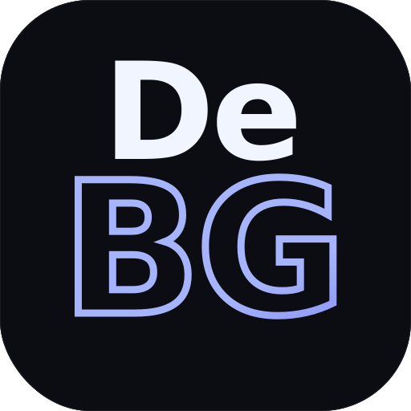

<div align="center">
  
  <h1>DeBG</h1>
  <p>Remove image backgrounds entirely on-device — no API keys, no cloud, no uploads.</p>

  
  
  
  
  
</div>

---

Powered by [danielgatis/rembg](https://github.com/danielgatis/rembg) running as a local inference server. Everything stays on your machine.

---

## Features

- **Bulk processing** — drag & drop any number of PNG / JPG / WEBP / BMP files
- **9 AI models** — from tiny 4.7 MB to high-quality 375 MB BiRefNet models
- **First-run setup wizard** — auto-detects Python or downloads it, creates a venv, and installs rembg
- **CPU & GPU (CUDA) backends** — switchable at any time from within the app
- **Post-processing controls** — threshold, edge feather, shrink/expand mask, background mode, alpha matting
- **Live re-apply** — sliders update all completed images instantly without re-running inference
- **Before/after comparison lightbox** — drag a slider to compare original vs result at full size
- **Gallery view modes** — large grid, small grid, or list view with pagination
- **Auto-save** — results saved to a configurable output folder as each image finishes
- **ZIP download** — export all results in one click
- **Cancel** — stop a running batch at any time

---

## Models

| Model | Size | Best for |
|---|---|---|
| BiRefNet General | ~375 MB | Best overall quality — any subject |
| BiRefNet Portrait | ~375 MB | People & complex hair |
| BRIA RMBG 1.4 | ~176 MB | E-commerce / advertising |
| ISNet General | ~176 MB | Fast + high accuracy |
| U²Net | ~176 MB | Classic general-purpose |
| U²Net Human | ~176 MB | Specialized for people |
| Silueta | ~43 MB | Compact & fast |
| ISNet Anime | ~176 MB | Anime & illustrations |
| U²Net Lite | ~4.7 MB | Smallest — fastest inference |

Models are downloaded automatically on first use and cached locally (`%AppData%\DeBG\models\`).

---

## Requirements

**To run a release:**
- Windows 10 / 11 (x64)
- Python 3.11 – 3.13 (auto-downloaded by the setup wizard if not found)
- GPU backend additionally requires an NVIDIA GPU with CUDA 11.8+

**To build from source:**
- Node.js 18+
- Git
- Windows 10 / 11 (x64)

---

## Running a release

1. Download `DeBG-portable-0.2.0.exe` from [Releases](../../releases) **or** extract `DeBG-win-unpacked-0.2.0.zip`
2. Run the exe — a first-run setup wizard opens automatically
3. Choose CPU or GPU backend and click **Install rembg** (~5–10 min first time)
4. Drop images, pick a model, click **Remove backgrounds**

> Python and rembg are handled entirely by the wizard — no manual setup needed.

---

## Running from source

The setup wizard runs automatically on first launch and handles Python + rembg for you.

```bash
git clone https://github.com/usmannazir95/DeBG.git
cd DeBG
npm install

# React only (no Electron, no AI — for UI dev)
npm run dev

# Full Electron app in dev mode (recommended)
npm run dev:electron
```

On first run of `npm run dev:electron` the setup wizard will open, detect or download Python, create a venv, and install rembg — exactly the same as a release build. After that the app is fully functional.

---

## Building

```bash
npm run dist
```

Outputs to `release/`:

| File | Use |
|---|---|
| `DeBG-portable-0.2.0.exe` | Single portable exe — copy anywhere and run |
| `win-unpacked/` | Unpacked folder — copy the whole folder and run `DeBG.exe` |

---

## Post-processing controls

| Control | What it does |
|---|---|
| **Threshold** | Hard-cuts the mask — higher removes more, lower keeps more |
| **Edge Feather** | Blurs the mask edge — good for hair and fur |
| **Shrink / Expand** | Erodes halo artefacts (negative) or loosens tight masks (positive) |
| **Background** | Transparent PNG / solid colour / blurred original |
| **Alpha Matting** | rembg's own alpha matting pass — much better fine edges, slower |

Sliders 1–4 re-apply instantly to all completed images. Alpha Matting requires a re-run.

---

## Architecture

```
electron/
  main.cjs            Electron main process — app lifecycle, IPC handlers, rembg server
  preload.cjs         Context bridge — exposes safe IPC API to the renderer
  setup-helpers.cjs   Python detection, download, venv creation, rembg install

src/
  main.jsx            Entry — routes to Setup wizard or main App
  Setup.jsx           First-run wizard (Python check → venv → rembg install)
  App.jsx             Main UI — gallery, lightbox, settings, batch processing
  worker.js           Web Worker — mask post-processing (threshold, feather, morph, composite)
  *.css               Styles
```

**Key design decisions:**

- `electron/` files use `.cjs` extension so CommonJS works alongside `"type":"module"` in `package.json`
- `webSecurity: false` on the BrowserWindow lets `fetch()` reach the local rembg server from `file://`
- rembg runs as `rembg s --host 127.0.0.1 --port 7777 --no-ui` — a local HTTP API
- The renderer never gets Node.js access (`nodeIntegration: false`, `contextIsolation: true`)
- `python -m pip` is used instead of `pip.exe` to avoid Windows file-lock errors during pip self-upgrade
- Model files live in `%AppData%\DeBG\models\` via the `U2NET_HOME` env var
- Output images auto-save to a user-configurable folder (default `Pictures\bg-removed\`)

---

## Adding a custom icon

Place a 256×256 `icon.ico` in `assets/` — electron-builder picks it up automatically.
